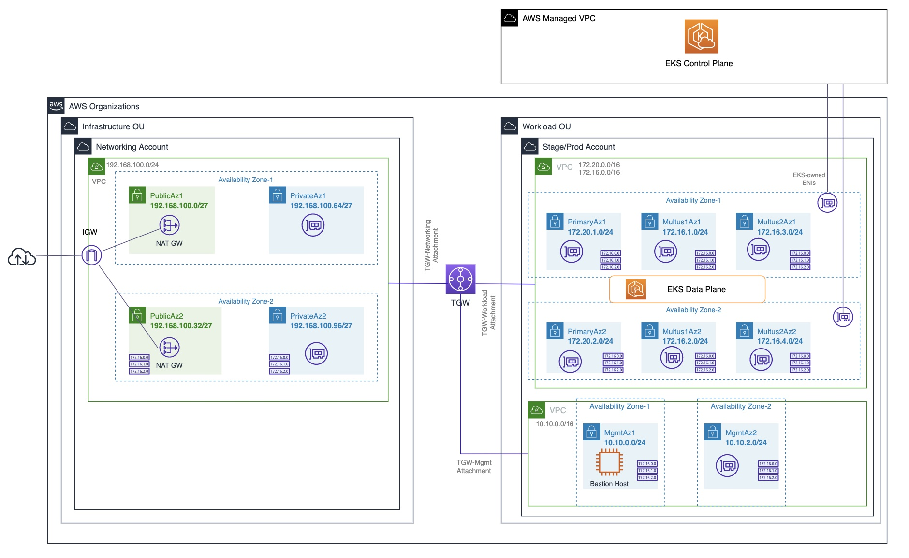

# EKS Automation Deployment

## Deploying CNFs on AWS with Amazon EKS

This repo outlines a step-by-step guide to run a set of CloudFormation scripts (Cfn) to launch AWS Services and Infrastructures that can host Containerized  Network Functions like 5G. The Cfn artifacts on this document are pre made and tested. It will be the discretion of the user to asses if the security posture of the resulting Infrastructure would fulfill their organizations security requirements. It is also the responsibility of the user to track the costs associated on deploying the infrastructure. The purpose of the document is to provide a ready AWS infrastructure needed by ISVs to be able to deploy network functions on AWS.

## Solution Overview

The CloudFormation artifacts enable to create VPC environment including public and private subnets, route table, IGW/NAT GW, and security group configuration. Amazon EKS helps self-managed cluster creation and Lambda-backed custom resource in CloudFormation template triggered by CloudWatch event can assign EKS worker nodegroup with multiple interfaces. And, helm deployment configures the namespace, load balancer creation, and CNF onboarding using Amazon ECR or vendor-specific helm chart. AWS EKS Cluster will be monitored through AWS-managed services for Prometheus and Grafana.

## Prerequisites

- Existence of an AWS Account
- We will use the us-east-1 Region to deploy the EKS cluster. 
- You must have set your CIDR ranges for VPC and Subnets
- User has necessary permission to execute the artifact and launch the services indicated on this workshop
- The application uses Amazon EKS as the K8S orchestration engine
- Basic understanding of AWS CloudFormation IaaC

## AWS Cloudformation Deployment Flow

## Target Architecture

## Step-by-Step Deployments

* **[Step 1](https://gitlab.aws.dev/sinunes/eks-automation-deployment/-/blob/main/Step%201%20-%20Infrastructure%20Setup/README-Part1.md)**: Provision EKS Infrastructure and Bastion Host

* **[Step 2](https://gitlab.aws.dev/sinunes/eks-automation-deployment/-/blob/main/Step%202%20-%20EKS%20Cluster%20Setup/README-Part2.md)**: Provision EKS Clusters and Self Managed Nodegroups
 
* **[Step 3](https://gitlab.aws.dev/sinunes/eks-automation-deployment/-/blob/main/Step%203%20-%20Multus%20and%20App%20Creation/README-Part3.md)**: Configure Multus and Deploy Sample Application

* **[Step 4](https://gitlab.aws.dev/sinunes/eks-automation-deployment/-/blob/main/Step%204%20-%20Observability/README-Part4.md)**: Monitoring AWS EKS using Amazon Managed Service for Prometheus and Grafana

* **[Step 5](https://gitlab.aws.dev/sinunes/eks-automation-deployment/-/blob/main/Step%205%20-%20AWS%20Outposts/README.md)**: Deploy EKS worker nodes on AWS Outposts
 
