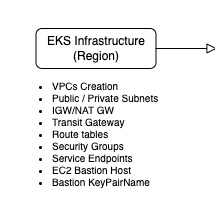
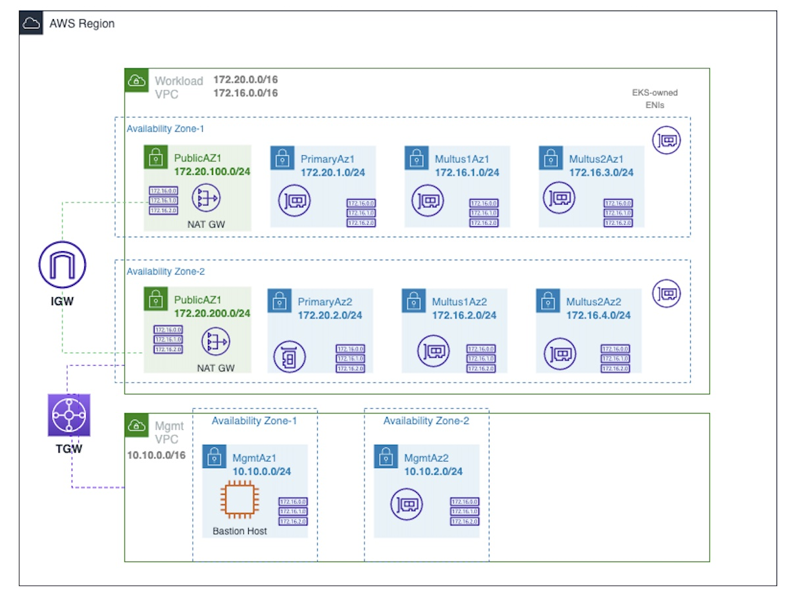
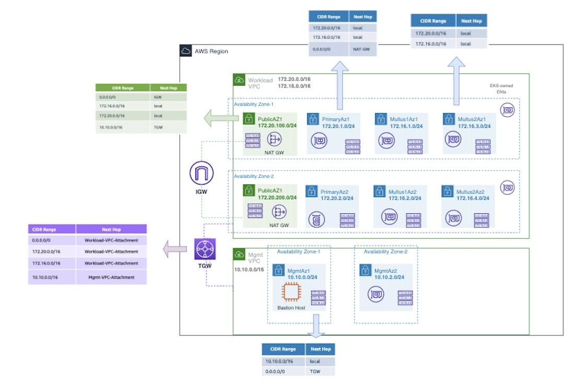

# Step 1: Provision EKS Infrastructure and Bastion Host



This step creates VPC, public/private subnets, subnet route tables, IGW, NAT-GW, Transit Gateway, Security Groups and Bastion host Instance



## 1.1: Workload VPC Assumptions (for the EKS worker nodes)

 * One Dual Stack VPC
 * Two CIDR ranges per VPC (the template can be adapted to support up to 5 CIDRs)
 * One private subnet per Availability Zone to be associated to the EKS worker node primary eth0. This subnet will have a separate route table pointing to the Transit Gateway in order to manage worker node package lifecycle.
 * There are no public ingress resources as this configuration is only used for workloads that do not need to receive any communications from the public internet.
 * Two private subnets per Availability Zone that Multus will use to create secondary interfaces in control and user plane pods. (the template can be adapted to increase the number of subnets according to the network segments requirement)
  * The multus subnets will not have outbound or inbound internet access. Only the communication inside the VPC is allowed.
 * Transit Gateway attachment to interconnect the Management and Workload VPCs
 * Per subnet security group
 * VPCs interface endpoints for the AWS services that pods need access to: ec2, s3, ecr.dkr, ecr.api, autoscaling, cloudwatch, and kms
  https://docs.aws.amazon.com/eks/latest/userguide/private-clusters.html

## 1.2: Management VPC Assumptions (for the Bastion Host)

* We will configure the management VPC where the Bastion Host will be provisioned to manage the EKS Cluster privately.
* In this scenario, the Bastion must be accessible only through the internal network, with outbound access to the internet through the Transit Gateway.
* This VPC will host the bastion host instance for kubectl command run through out private access.

## 1.3: Steps to create a key pair for Bastion Host ssh access

*   Follow the steps below to create a key pair, which allows you to securely connect to the Bastion Host instance after it launches.
*   Name it as my-default-keypair

https://docs.aws.amazon.com/AWSEC2/latest/UserGuide/create-key-pairs.html

*   After creating it, the private key file is automatically downloaded by your browser. Save the private key file in a safe place.

## 1.4: Cloudformation Template:

````
 EKS-infra.yaml
````

*   Next, go to CloudFormation console by selecting CloudFormation from Services drop down or by search menu.
    *   Select Create stack, with new resources(standard).
    *   Click Template is ready (default), "Upload a template file", "Choose file". Select "EKS-infra.yaml" file that you have downloaded from this Gitlab.
    *   Stack name -> eks-infra

* Management VPC Configuration (for the Bastion Host)

    *   VpcCidr -> CIDR range for the VPC (worker node primary subnets)
    *   VpcCidr2 -> 2nd CIDR range for the VPC (multus subnets)
    *   Availability Zones -> choose us-east-1a and us-east-1b 
    *   PublicSubnetAz1Cidr -> CIDR block for the Public Subnet in AZ1 
    *   PublicSubnetAz2Cidr -> CIDR block for the Public Subnet in AZ2 
    *   PrimarySubnetAz1Cidr -> CIDR block for the Primary Subnet in AZ1 (worker node primary subnet)
    *   PrimarySubnetAz2Cidr -> CIDR block for the Primary Subnet in AZ2 (worker node primary subnet)
    *   MultusSubnet1Az1Cidr  -> CIDR block for the Multus Subnet in AZ1 
    *   MultusSubnet1Az2Cidr  -> CIDR block for the Multus Subnet in AZ2
    *   MultusSubnet2Az1Cidr  -> CIDR block for the Multus Subnet in AZ1 
    *   MultusSubnet2Az2Cidr  -> CIDR block for the Multus Subnet in AZ2 

* Management VPC Configuration (for the Bastion Host)

    *   VpcCidr3 -> management VPC Cidr
    *   Availability Zones -> choose us-east-1a and us-east-1b 
    *   MgmtAz1 and MgmtAz2 -> private subnets for the bastion host
    *   BastionInstanceType -> Select the EC2 instance type for a bastion host (t2.small or t2.medium is fine)
    *   BastionKeyPairName -> my-default-keypair
    *   LatestAmiId -> default linux image required to launch the bastion host
    *   Enable IPv6 -> enable IPv6 support

## 1.5: Routing Scheme

### Assumptions

* There are no public ingress resources
* Private subnets associated to the bastion and the worker node primary ethernet0 will have outbound internet access pointing to the Transit Gateway
* The multus subnets will not have outbound or inbound internet access. Only private communication inside the VPC is allowed
* VPC endpoints to privately connect the stage account VPC to public AWS Services

### Create a static route 

To complete the infrastructure configuration setup, we will create a static route to allow outbound Internet connectivity from the primary and management subnets in the Stage account.

    * Go to the AWS Management Console.
    * On the navigation pane, go to the VPC dashboard and choose Transit Gateway Route Tables.
    * Select the route table for which to create a route.
    * Choose Actions, Create static route.
    * On the Create static route page, enter with the destination set to 0.0.0.0/0, and then choose Active.
    * Choose the Workload-VPC-Attachment
    * Choose Create static route.



