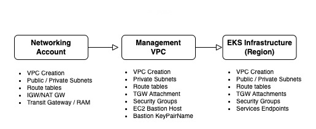
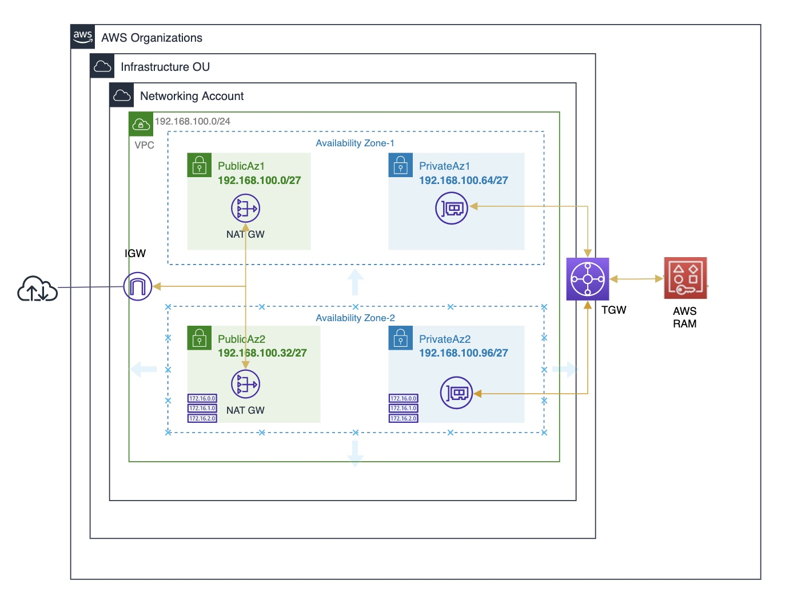
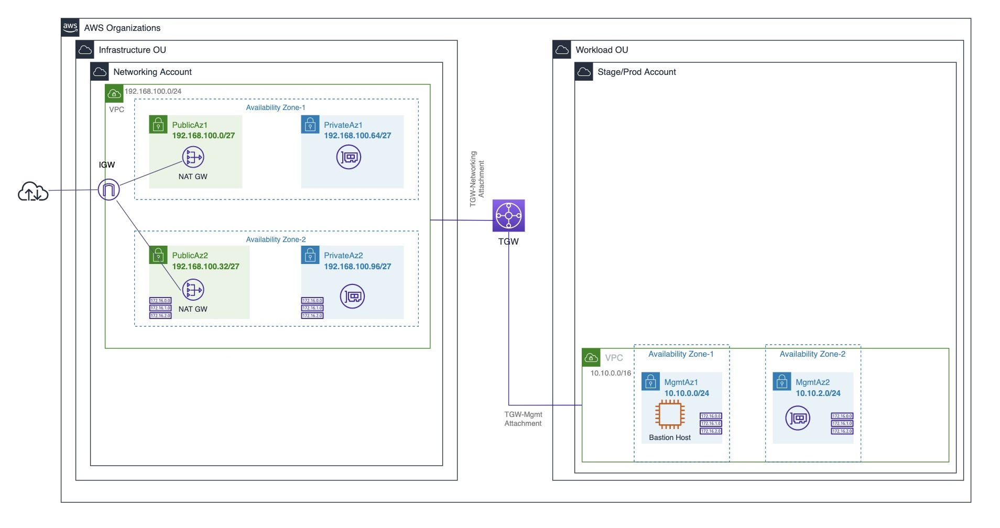
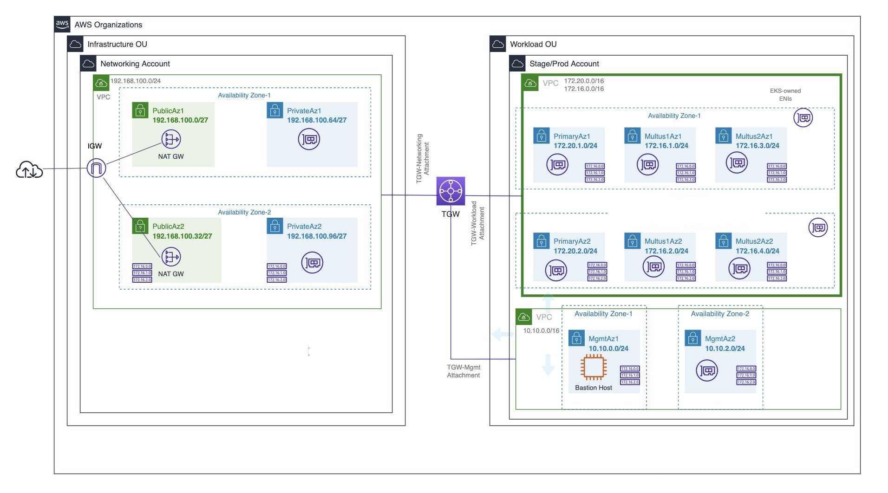
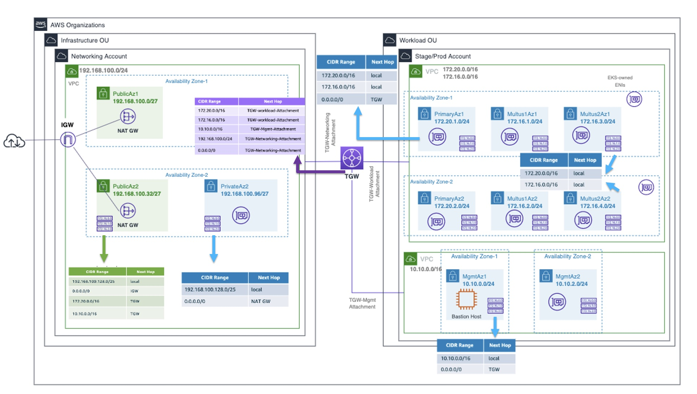

# Step 1: Provision EKS Infrastructure and Bastion Host



## 1.1: Deploy the Networking Account in the AWS Organization

To support easier management of the provisioned VPCs in a multi-account enviroment, a VPC in a central networking account has being considered. 
The Networking account serves as the central hub for network routing between multi-account landing zone accounts, your on-premises network, and egress traffic out to the Internet. Within the hub VPC in the networking account, we will deploy NAT gateways (one in each Availability Zone) and an internet gateway, along with the AWS Transit Gateway to centralize outbound internet traffic from the specific subnets in the Stage Account using hub-and-spoke design. 



Figure 1: Architecture diagram showing AWS Transit Gateway to centralize outbound internet traffic from the stage account specific subnets.

If you prefer to automate the entire network account setup, you can follow the instructions here to deploy all the components. Make sure to choose the sa-east-1 Region for this stack before you deploy the components.

### Cloudformation Template:

````
  Networking-Account-Infra.yaml
````

*   Go to CloudFormation console by selecting CloudFormation from Services drop down or by search menu.
    *   Select Create stack, with new resources(standard).
    *   Click Template is ready (default), "Upload a template file", "Choose file". Select "Networking-Account-Infra.yaml" file that you have downloaded from this Gitlab.
    *   Stack name -> network-account
    *   VpcCidr -> network-account
    *   Availability Zones -> choose sa-east-1a and sa-east-1b  (2 AZs required to deploy NAT gateways in each one).
    *   Public AZs -> NAT Gateway association
    *   Private AZs -> Transit Gateway Attachment association
    *   AWS RAM Sharing -> Enable Transit Gateway sharing with the specific AWS Account ID (Stage Account in our case)
    *   Management VPC Cidr -> to provide outbount internet access from the bastion host in the Management VPC
    *   EKS Private Subnet Configuration -> to provide outbount internet access from the EKS worker node primary eth0 subnet in the workload VPC
    *   Enable IPv6 -> enable IPv6 support
    *   There is nothing to specify in "Configure Stack options" page, so please click again "Next" at the bottom.
    *   At Review page, go bottom of the page and click checkbox for "I acknowledge that AWS...", and then click "Create stack".
    *   Once CloudFormation stack creation is completed, check Output part in the menu and copy the value of TransitGatewayId (you need to use this as input to one of the parameters for step 2)


## 1.2: Deploy the Management VPC in the Stage Account

Once the networking account has been provisioned, we will configure the management VPC where the Bastion Host will be provisioned to manage the EKS Cluster privately. In this scenario, the Bastion must be accessible only through the internal network, with outbound access to the internet through the shared Transit Gateway.
This VPC will host the bastion host instance for kubectl command run through out private access.



### Steps to create a key pair for Bastion Host ssh access

*   Follow the steps below to create a key pair, which allows you to securely connect to the Bastion Host instance after it launches.
*   Name it as my-default-keypair

https://docs.aws.amazon.com/AWSEC2/latest/UserGuide/create-key-pairs.html

*   After creating it, the private key file is automatically downloaded by your browser. Save the private key file in a safe place.

### Cloudformation Template:

````
  Mgmt-VPC.yaml
````

*   Next, go to CloudFormation console by selecting CloudFormation from Services drop down or by search menu.

    *   Select Create stack, with new resources(standard).
    *   Click Template is ready (default), "Upload a template file", "Choose file". Select "Mgmt-VPC.yaml" file that you have downloaded from this Gitlab.
    *   Stack name -> management-vpc
    *   VpcCidr -> management vpc Cidr
    *   Availability Zones -> choose sa-east-1a and sa-east-1b 
    *   MgmtAz1 and MgmtAz2 ->private subnets for the bastion host
    *   TransitGatewayID -> TransitGatewayId you took note in the step 1 
    *   BastionInstanceType -> Select the EC2 instance type for a bastion host (t2.small or t2.medium is fine)
    *   BastionKeyPairName -> my-default-keypair
    *   LatestAmiId -> default linux image required to launch the bastion host
    *   Enable IPv6 -> enable IPv6 support


## 1.3: Deploy the EKS infrastructure in the Stage Account



### This lab creates the infrastructure for the EKS deployment according to the following assumptions:

* One Dual Stack VPC
* Two CIDR ranges per VPC (the template can be adapted to support up to 5 CIDRs)
* One private subnet per Availability Zone to be associated to the EKS worker node primary eth0. This subnet will have a separate route table pointing to the Transit   Gateway in order to manage worker node package lifecycle.
* There are no public ingress resources as this configuration is only used for workloads that do not need to receive any communications from the public internet.
* Two private subnets per Availability Zone that Multus will use to create secondary interfaces in control and user plane pods. (the template can be adapted to increase the number of subnets according to the network segments requirement)
* The multus subnets will not have outbound or inbound internet access. Only the communication inside the VPC is allowed.
* Transit Gateway attachment to interconnect the Managament VPC and Networking Account
* Per subnet security group
* VPCs interface endpoints for the AWS services that pods need access to: ec2, s3, ecr.dkr, ecr.api, autoscaling, cloudwatch, and kms
  https://docs.aws.amazon.com/eks/latest/userguide/private-clusters.html

### Cloudformation Template:

````
 EKS-infra.yaml
````

*   Next, go to CloudFormation console by selecting CloudFormation from Services drop down or by search menu.

    *   Select Create stack, with new resources(standard).
    *   Click Template is ready (default), "Upload a template file", "Choose file". Select "EKS-infra.yaml" file that you have downloaded from this Gitlab.
    *   Stack name -> eks-infra
    *   VpcCidr -> CIDR range for the VPC (worker node primary subnets)
    *   VpcCidr2 -> 2nd CIDR range for the VPC (multus subnets)
    *   Availability Zones -> choose sa-east-1a and sa-east-1b 
    *   PrimarySubnetAz1Cidr -> CIDR block for the Primary Subnet in AZ1 (worker node primary subnet)
    *   PrimarySubnetAz2Cidr -> CIDR block for the Primary Subnet in AZ2 (worker node primary subnet)
    *   TransitGatewayID -> TransitGatewayId you took note in the step 1 
    *   MultusSubnet1Az1Cidr  -> CIDR block for the Multus Subnet in AZ1 
    *   MultusSubnet1Az2Cidr  -> CIDR block for the Multus Subnet in AZ2
    *   MultusSubnet2Az1Cidr  -> CIDR block for the Multus Subnet in AZ1 
    *   MultusSubnet2Az2Cidr  -> CIDR block for the Multus Subnet in AZ2 
    *   BastionVPC -> CIDR block for the Management VPC (to configure the rule in the security group)


## 1.4: Routing Scheme


### Assumptions

* There are no public ingress resources
* Private subnets associated to the bastion and the worker node primary ethernet0 will have outbound internet access pointing to the Transit Gateway
* The multus subnets will not have outbound or inbound internet access. Only private communication inside the VPC is allowed
* VPC endpoints to privately connect the stage account VPC to public AWS Services

### Create a static route 

To complete the infrastructure configuration setup, we will create a static route to allow outbound Internet connectivity from the primary and management subnets in the Stage account.

    * Access the Networking AWS account.
    * Go to the AWS Management Console.
    * On the navigation pane, go to the VPC dashboard and choose Transit Gateway Route Tables.
    * Select the route table for which to create a route.
    * Choose Actions, Create static route.
    * On the Create static route page, enter with the destination set to 0.0.0.0/0, and then choose Active.
    * Choose the TGW-Network-Attachment (the same one associated to the network account)
    * Choose Create static route.



