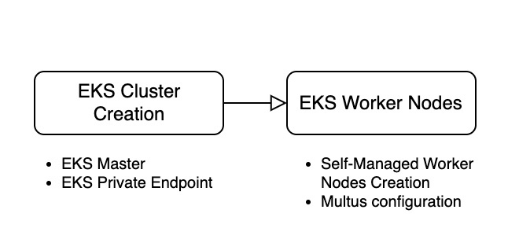
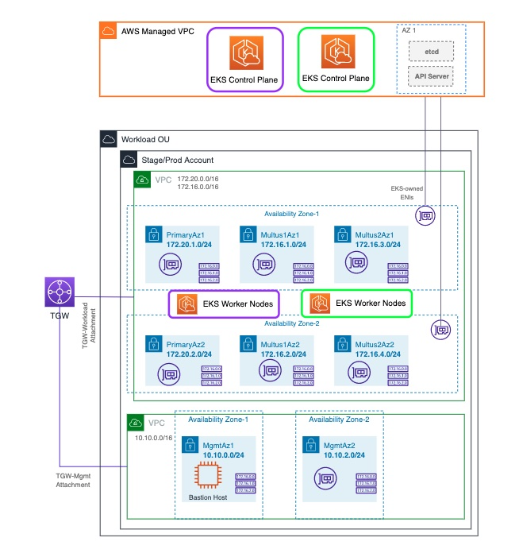
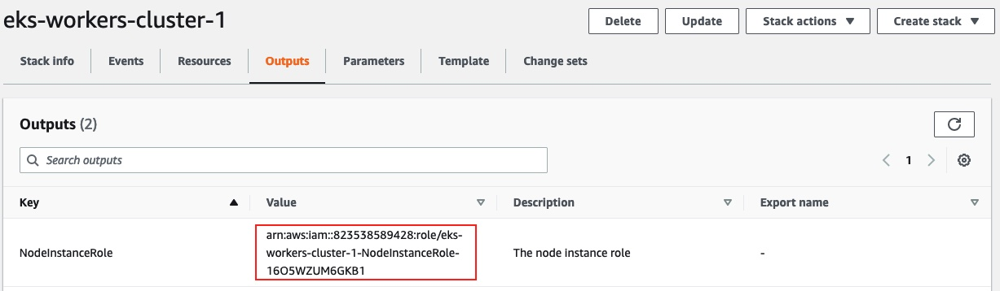

# Step 2: Provision EKS Clusters and Self Managed Nodegroups




## Technical Assumptions

* This solution allows you to define the number of a EKS Cluster to be deployed. Depending on the use case, you can either choose to deploy all the network functions in a single or multi-cluster mode.
* To deploy EKS masters in the AWS Region.
* The CNFs to be deployed across multiple availability Zones in the AWS Region.
* You can choose either for a public or private  Amazon EKS cluster endpoint .
* EKS Private endpoint only to enforce all traffic to the cluster API server must come from within the cluster’s VPC or a connected network. Any kubectl commands must come from within the Management VPC (bastion host).
* Additional VPC endpoints are required to access AWS public services API without outbound internet access, such as ECR (Amazon Elastic Container Registry), Amazon CloudWatch Logs, IAM roles for service accounts, Amazon S3, EC2 (Elastic Compute Cloud), SSM (AWS Systems Manager)



## 2.1: Deploy the EKS Clusters

* This template takes the Output of the VPC and subnets from the EKS Infrastructure cloudformation template as one input parameter
* This solution allows you to define the number of a EKS Cluster to be deployed. Depending on the use case, you can either choose to deploy all the network functions in a single or
multi-cluster mode.
* Two EKS Clusters will be automatically provisioned by the cfn template
* By default creates a private EKS cluster
* Before creating the cluster, take notes of your own AWS Credentials (AWS_DEFAULT_REGION, AWS_ACCESS_KEY_ID, AWS_SECRET_ACCESS_KEY). It is important as initially, only the creator of the Amazon EKS cluster has permissions to configure the cluster. 

### Set up a Cloudformation macro:

In order to deploy multiples EKS Clusters at once, we are going to leverage the Cloudformation Macros.
CloudFormation macros are like pre-processors of your CloudFormation templates. After you submit your CloudFormation template, macros are called to transform portions of your template before CloudFormation actually starts provisioning resources.
Under the hood, macros are powered by AWS Lambda functions that you write. They should be functional components that take in some existing CloudFormation and output additional CloudFormation.

- Go to S3 and create bucket (folder/directory) with Create bucket.
- Bucket name to be unique count-cloudformation-macro-your-name (recommend to use your name or unique keyword), and then Create bucket.
- Click the bucket you just created and drag & drop c6bcffd28b44b4f43ba5a0127047489c file (which you can find from /template directory of this Gitlab). Then, click Upload.
- Now edit the file Count-macro.yaml (which you can find from /template directory of this Gitlab) and update the CodeUri with the bucket name you just created (CodeUri: s3://count-cloudformation-macro-your-name/c6bcffd28b44b4f43ba5a0127047489c)
- Go to CloudFormation console by selecting CloudFormation from Services drop down or by search menu.
- Click Template is ready (default), "Upload a template file", "Choose file". Select "Count-macro.yaml" file that you have downloaded from this GitHlab.
- Stack name -> cfn-macro-count
- There is nothing to specify in "Configure Stack options" page, so please click again "Next" at the bottom.
- At Review page, go bottom of the page and click checkbox for "I acknowledge that AWS...", and then click "Create stack".


### Cloudformation Template for EKS Clusters Deployment:

````
  EKS-Cluster.yaml
````

*   Go to CloudFormation console by selecting CloudFormation from Services drop down or by search menu.
    *   Select Create stack, with new resources(standard).
    *   Click Template is ready (default), "Upload a template file", "Choose file". Select "EKS-Cluster.yaml" file that you have downloaded from this Gitlab.
    *   Stack name -> eks-cluster
    *   k8SvVersion -> Kubernetes Version (As of today (10/28/2022), the EKS cluster is created with K8s 1.23 version.
    *   EndpointPrivateAccess -> True (if you want your EKS cluster endpoint to be Private. kubectl commands can only be executed from inside the VPC or connected network)
    *   EndpointPublicAccess -> False (you can change it to True if you want your EKS Cluster endpoint to be Public)
    *   InfraEKSName -> eks-infra (the name of the eks infrastructure cloudformation template for VPC-Subnets configuration)

## 2.2: Login to Bastion Host

We Usually guide customers to experience Cloud9 (AWS IDE environment). But in this project, we plan to provide a general environment with your own Bastion Host EC2 instance, where you have to install kubectl tools and other tools as needed.

* As the bastion host is configured in a private subnet within the Management VPC, you can use EC2 Instance Connect to login to EC2 instance from AWS Console
* EC2 ->Instances-> Bastion-> "connect" (right top corner of screen).
* click "connect"
* Upgrade the AWS CLI from version 1 to version 2

````
sudo yum remove awscli
curl "https://awscli.amazonaws.com/awscli-exe-linux-x86_64.zip" -o "awscliv2.zip"
unzip awscliv2.zip
sudo ./aws/install
export PATH=/usr/local/bin:$PATH
source ~/.bash_profile
````

## 2.3: Configure the AWS credentials

* Configure the AWS credentials of the EKS cluster creator.(the same credentials you have copied at lab 1).

````
Login as a root user (sudo su)
$ aws configure
AWS Access Key ID [****************VCMD]: 
AWS Secret Access Key [****************B0f2]: 
Default region name [sa-east-1]: sa-east-1
Default output format [json]: 
````

* Confirm credentials with below command.
````
aws sts get-caller-identity
````

````
Output:

{
"Account": "my-account",
"UserId": "CROAY6YKLVK242KL6D5W3:my-user-id",
"Arn": "arn:aws:sts::my-account:assumed-role/Admin/my-user-id"
}
````

### Make a Bastion Host to be a kubectl client

* Login as a root user (sudo su)
* Download kubectl

````
    sudo yum update -y
    curl -o kubectl https://s3.us-west-2.amazonaws.com/amazon-eks/1.23.7/2022-06-29/bin/linux/amd64/kubectl
    chmod +x ./kubectl
    mkdir -p $HOME/bin && cp ./kubectl $HOME/bin/kubectl && export PATH=$PATH:$HOME/bin 
    echo 'export PATH=$PATH:$HOME/bin' >> ~/.bashrc
    echo 'export PATH=$PATH:/usr/local/bin' >> ~/.bashrc
    kubectl version --short --client
````
* Download Helm, git and eksctl

````
    curl https://raw.githubusercontent.com/helm/helm/master/scripts/get-helm-3 > get_helm.sh
    chmod 700 get_helm.sh
    ./get_helm.sh
    sudo yum install git -y
    curl --silent --location "https://github.com/weaveworks/eksctl/releases/latest/download/eksctl_$(uname -s)_amd64.tar.gz" | tar xz -C /tmp
    sudo mv /tmp/eksctl /usr/local/bin


````

* Config kubeconfig with EKS CLI (please be mindful to use your own cluster name), you have to check your EKS cluster name you created from the CloudFormation in the LAB 1. 
* If you have chosen to deploy multiple EKS Clusters, you can pick just one of them

````
    aws eks update-kubeconfig --name=my-eks-cluster
````

* Test EKS Control plane access

````
    kubectl get svc
    NAME         TYPE        CLUSTER-IP   EXTERNAL-IP   PORT(S)   AGE
    kubernetes   ClusterIP   172.20.0.1   <none>        443/TCP   31m
````   
* Verify it from AWS CLI

````
aws eks describe-cluster --name=my-eks-cluster
````

## 2.3: Deploy the EKS Self-managed Worker Nodes for Multus


### Technical Assumptions

* To deploy a self-managed node group in the region for Multus deployment 
* Worker nodes are instanciated in private subnets 
* Primary pod interface eth0 is associated to private subnet called Primary, while the secondary interfaces are associated to the multus private subnets
* Two multus subnets are initially provisioned in this project, but you can adjust the number of subnets according to the CNFs requirements
* You can define the number of worker node groups you want to deploy

### Automation through CloudFormation, LifeCycle Hook, CloudWatch Event, and Lambda

* Multus is supported on self-managed nodes. 
* Multus requires additional ENIs to be available on the nodes.
* These ENIs are mapped to additional subnets reserved for Multus use cases.
* We will AWS Lambda function combined with Amazon CloudWatch event rule to attach ENIs from Multus subnets along with tag sh no_manage: true. 
* AWS VPC CNI will not manage ENI’s tagged no_manage: true. This is a must step for Multus to manage additional networks for Pods.

### Lambda function for attaching additional Multus subnet networks to worker nodes:

* Before running this CloudFormation, you have to upload the lambda_function.zip file to your S3 bucket. 
* Go to S3 and create a bucket
* Bucket name to be unique like cnf-project-myname (recommend to use your name or unique keyword here), and then Create bucket.
* Click the bucket you just created and drag & drop lambda_function.zip file (which you can find from /template directory of this Gitlab). Then, click Upload.
* Please memorize bucket name you create, the S3 bucket name will be used as one of the input parameters when running the CloudFormation below.

### Cloudformation Template:

````   
  EKS-NodeGroup.yaml
````

*   Go to CloudFormation console by selecting CloudFormation from Services drop down or by search menu.
    *   Select Create stack, with new resources(standard).
    *   Click Template is ready (default), "Upload a template file", "Choose file". Select "EKS-Cluster.yaml" file that you have downloaded from this Gitlab.
    *   Stack name -> eks-worker-nodes-cluster-1
    * EKS Cluster:
      * EKSClusterStack -> EKS Cluster Cloudformation Template name
      * EKS Cluster Name -> Specify the cluster name provided when the cluster was created. If it is incorrect, nodes will not be able to join the cluster.
    * Worker Node Configuration:
      * NodeGroupName ->  Enter multus-cluster-ng01 as the Node group name
      * Specify 2 for node autoscaling group desired capacity, max, and min size.
      * Choose c5.large for instance type and 20 for volume size.
      * Use default Node ImageId SSM Param
      * Choose the EC2 key pair created under the prerequisites section.
      * NodeImageId -> optional in case you want to use your own custom image id
      * You can use the default parameters for bootstrap.
      * useIPsFromStartOfSubnet -> true
    * Worker Network Configuration:
      * VpcId -> vpc for infrastructure eks
      * Subnets -> primaryAZ1 (this is for main primary K8s networking network)
      * InfraEKSName -> name of the EKS infrastructure cloudformation template
    * Multus CNI Configuration:
      * MultusSubnets: Multus1AZ1 and Multus2AZ1
      * LambdaS3Bucket -> the one you created
      * LambdaS3Key -> lambda_function.zip
* There is nothing to specify in "Configure Stack options" page, so please click again "Next" at the bottom.
* At Review page, go bottom of the page and click checkbox for "I acknowledge that AWS...", and then click "Create stack".

Once CloudFormation stack creation is completed, take note of the ‘rolearn’ with NodeInstanceRole (output from worker node groups CloudFormation stack, e.g. arn:aws:iam::153318889914:role/ng1-NodeInstanceRole-1C77OUUUP6686 --> this is an example, you have to use your own)




* Go to the Bastion Host where we can run kubectl command.
* Download aws-auth-cm file at Bastion Host.

````   
curl -o aws-auth-cm.yaml https://s3.us-west-2.amazonaws.com/amazon-eks/cloudformation/2020-10-29/aws-auth-cm.yaml
```` 
* Open aws-auth-cm.yaml file downloaded using vi or any text editor. And place above copied NodeInstanceRole value to the place of "<ARN of instance role (not instance profile)>", and then apply this through kubectl.

````   
    kind: ConfigMap
    metadata:
      name: aws-auth
      namespace: kube-system
    data:
      mapRoles: |
        - rolearn: arn:aws:iam::153318889914:role/ng1-NodeInstanceRole-1C77OUUUP6686
          username: system:node:{{EC2PrivateDNSName}}
          groups:
            - system:bootstrappers
            - system:nodes
````   
* Apply the new ConfigMap to the RBAC configuration of the cluster: 

````
kubectl apply -f aws-auth-cm.yaml
````
* Verify you have access to the cluster: 
````
kubectl get nodes
````

If everything is set up correctly, then you don't get an unauthorized error message. The output should list all the pods that are running in the default namespace. If the output shows that no resources are found, then no pods are running in the default namespace.

````
NAME                           STATUS   ROLES    AGE   VERSION
ip-172-20-1-142.ec2.internal   Ready    <none>   43m   v1.23.9-eks-ba74326
ip-172-20-1-93.ec2.internal    Ready    <none>   43m   v1.23.9-eks-ba74326
````

