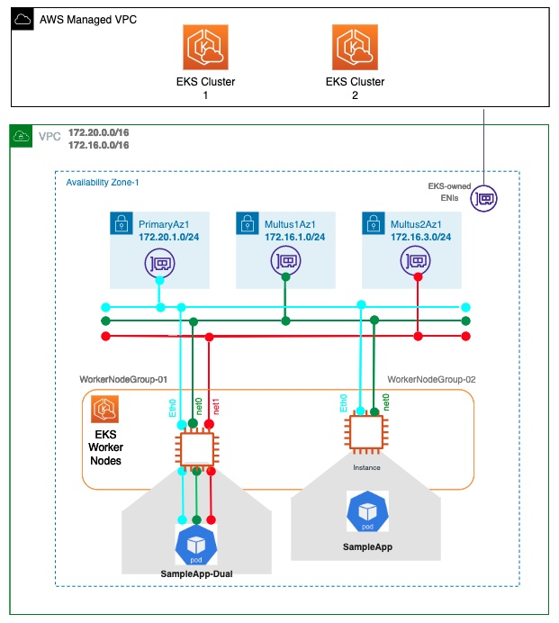

# Step 3: Configure Multus and Deploy sample application

A CNI is the container network interface that provides an application programming interface to configure network interfaces in containers. Multus CNI is a container network interface plugin for Kubernetes that enables attaching multiple network interfaces to Pods. In Kubernetes, each Pods has only one network interface by default, other than local loopback. With Multus, you can create multi-homed Pods that have multiple interfaces. Multus acts as ‘meta’ plugin that can call other CNI plugins to configure additional interfaces.

Multiple network interfaces for Pods are useful in various use cases; examples include:

* Traffic splitting: Running network functions that require separation of control/management, and data/user plane network traffic to meet low latency Quality of Service (QoS) requirements.
* Performance: Additional interfaces often leverage specialized hardware specifications such as Single Root I/O Virtualization (SR-IOV) and Data Plane Development Kit (DPDK), which bypass the operating system kernel for increased bandwidth and network performance.
* Security: Supporting multi-tenant networks with strict traffic isolation requirements. Connecting multiple subnets to Pods to meet compliance requirements.

The current version of EKS support for Multus bundles Amazon VPC CNI as the default delegate plugin (which is the only supported and validated default delegate plugin). The default delegate plugin configures the primary network interface (eth0) for Pods to enable Kubernetes control plane traffic, including the IP Address Management (IPAM) for the primary network interface for the Pods.

## 3.1: Install and configure Multus

### Install Multus CNI using a daemonset

* Log in to the bastion host where you can run kubectl commands.
* Run the following command to download and install the Multus daemonset. This command configures AWS VPC CNI as the default delegate plugin for Multus CNI.

````
kubectl apply -f https://raw.githubusercontent.com/aws/amazon-vpc-cni-k8s/master/config/multus/v3.7.2-eksbuild.1/aws-k8s-multus.yaml
````

* Validate the deployment by running the following command. Each node should have one pod named kube-multus-ds.

````
kubectl get pods -n kube-system
````

### Creating additional interfaces

Next, we’ll create configurations for each additional interface we add to pods. Multus provides a Custom Resource Definition (CRD) named NetworkAttachmentDefinition. We’ll use this CRD to construct additional interface settings.


* Create ipvlan-conf-1
  - Copy and paste the following code in order to create below networkAttachmentDefinition (ipvlan-conf-1.yaml)
  - Use ipvlan CNI to configure an additional interface (from Multus subnet1 172.16.1.0/24) for the pod. 

````
cat <<EOF > ipvlan-conf-1.yaml
apiVersion: "k8s.cni.cncf.io/v1"
kind: NetworkAttachmentDefinition
metadata:
  name: ipvlan-conf-1
spec:
  config: '{
      "cniVersion": "0.3.0",
      "type": "ipvlan",
      "master": "eth1",
      "mode": "l3",
      "ipam": {
        "type": "host-local",
        "subnet": "172.16.1.0/24",
        "rangeStart": "172.16.1.70",
        "rangeEnd": "172.16.1.80",
        "gateway": "172.16.1.1"
      }
    }'
EOF
````

Apply configuration to the cluster:

````
kubectl apply -f ipvlan-conf-1.yaml
````

* Create ipvlan-conf-2
  - Copy and paste the following code in order to create a second networkAttachmentDefinition (ipvlan-conf-2.yaml)
  - It will create another ipvlan CNI for the second Multus subnet 2 (172.16.3.0/24). 

````
cat <<EOF > ipvlan-conf-2.yaml
apiVersion: "k8s.cni.cncf.io/v1"
kind: NetworkAttachmentDefinition
metadata:
  name: ipvlan-conf-2
spec:
  config: '{
      "cniVersion": "0.3.0",
      "type": "ipvlan",
      "master": "eth2",
      "mode": "l3",
      "ipam": {
        "type": "host-local",
        "subnet": "172.16.3.0/24",
        "rangeStart": "172.16.3.70",
        "rangeEnd": "172.16.3.80",
        "gateway": "172.16.3.1"
      }
    }'
EOF
````

Apply configuration to the cluster:

````
kubectl apply -f ipvlan-conf-2.yaml
````


## 3.2: Deploy Sample Application

### Create a Docker Image 

* Prepare docker environment (at your bastion host EC2 instance) 

````
sudo yum install docker -y
sudo groupadd docker
sudo usermod -aG docker ${USER}
sudo service docker start
````
* Create a directory for Dockerfile creation. 

````
mkdir dockerimage
cd dockerimage
````

* Copy and paste the below code in order to create a dockerfile:

````
cat <<EOF > Dockerfile
FROM ubuntu:focal
ENV DEBIAN_FRONTEND noninteractive
RUN apt-get update && apt-get install -y net-tools iputils-ping iproute2 python python3 pip vim
RUN pip install boto3 requests
WORKDIR /
EOF
````

## 3.3: Upload Image to the ECR Repository 

* Create an ECR repository in ECR Console. "ECR" -> "Repositories"->"Create repository" -> "Private". * put your own repo name such as, "my-docker-image" (The name must start with a letter and can only contain lowercase letters, numbers, hyphens, underscores, and forward slashes) -> "Create repository".
* Run below commands at Bastion host (where you created a docker image). 

````
aws ecr get-login-password --region us-east-1 | docker login --username AWS --password-stdin xxxxxxxxx.dkr.ecr.us-east-1.amazonaws.com
docker build -t my-docker-image .
docker tag my-docker-image:latest xxxxxxxxx.dkr.ecr.us-east-1.amazonaws.com/my-docker-image:latest
docker push xxxxxxxxx.dkr.ecr.us-east-1.amazonaws.com/my-docker-image:latest
````
*keep in mind that, use your account number in place of xxxxxxxxx and Image ID of your docker (you can retrieve all information from above docker images command and from AWS ECR console)*

## 3.4: Create Sample App using uploaded Docker image from ECR privaty repository 



### Deploy sample application with single ipvlan attachment

* Log in to the bastion host where you can run kubectl commands.
* Create a sample application sampleapp with network annotation we created in the previous step.
* Copy and paste the below code to create a file named sampleapp.yaml
* keep in mind that, use your account number in place of xxxxxxxxx and Image ID of your docker (you can retrieve all information from above docker images command and from AWS ECR console)

````
cat <<EOF > sampleapp.yaml
apiVersion: v1
apiVersion: v1
kind: Pod
metadata:
  name: sampleapp
  annotations:
    k8s.v1.cni.cncf.io/networks: ipvlan-conf-1
spec:
  containers:
  - name: sampleapp
    command: ["/bin/bash", "-c", "trap : TERM INT; sleep infinity & wait"]
    image: xxxxxxxxx.dkr.ecr.us-east-1.amazonaws.com/my-docker-image:latest
EOF
````

* Apply the configuration and verify the pod has been properly created:

````
kubectl apply -f sampleapp.yaml
kubectl describe pod sampleapp
````

* Verify your Pod whether it has 2 interfaces (one for default K8s networking and the other for Multus interface - 172.16.1.0/24)

````
kubectl exec -it sampleapp -- /bin/bash
(in sampleapp) ifconfig
````

````
**eth0:** flags=4163<UP,BROADCAST,RUNNING,MULTICAST>  mtu 9001
        inet **172.20.1.214**  netmask 255.255.255.255  broadcast 0.0.0.0
        ether b2:83:10:27:b5:4f  txqueuelen 0  (Ethernet)
        RX packets 4  bytes 360 (360.0 B)
        RX errors 0  dropped 0  overruns 0  frame 0
        TX packets 0  bytes 0 (0.0 B)
        TX errors 0  dropped 0 overruns 0  carrier 0  collisions 0

lo: flags=73<UP,LOOPBACK,RUNNING>  mtu 65536
        inet 127.0.0.1  netmask 255.0.0.0
        loop  txqueuelen 1000  (Local Loopback)
        RX packets 0  bytes 0 (0.0 B)
        RX errors 0  dropped 0  overruns 0  frame 0
        TX packets 0  bytes 0 (0.0 B)
        TX errors 0  dropped 0 overruns 0  carrier 0  collisions 0

**net1**: flags=4291<UP,BROADCAST,RUNNING,NOARP,MULTICAST>  mtu 1500
        inet **172.16.1.74**  netmask 255.255.255.0  broadcast 172.16.1.255
        ether 02:9b:07:fb:2e:71  txqueuelen 0  (Ethernet)
        RX packets 0  bytes 0 (0.0 B)
        RX errors 0  dropped 0  overruns 0  frame 0
        TX packets 0  bytes 0 (0.0 B)
        TX errors 0  dropped 0 overruns 0  carrier 0  collisions 0
````

### Deploy sample application with dual ipvlan attachment 

* Create a sample application sampleapp-dual with dual network annotations *(ipvlan-conf-1 and ipvlan-conf-2)* we created in the previous step.
* Copy and paste the below code to create a file named sampleapp-dual.yaml
* keep in mind that, use your account number in place of xxxxxxxxx and Image ID of your docker (you can retrieve all information from above docker images command and from AWS ECR console)

````
cat <<EOF > sampleapp-dual.yaml
apiVersion: v1
kind: Pod
metadata:
  name: sampleapp-dual
  annotations:
    k8s.v1.cni.cncf.io/networks: ipvlan-conf-1, ipvlan-conf-2
spec:
  containers:
  - name: sampleapp-dual
    command: ["/bin/bash", "-c", "trap : TERM INT; sleep infinity & wait"]
    image: xxxxxxxxx.dkr.ecr.us-east-1.amazonaws.com/my-docker-image:latest
EOF
````

* Apply the configuration and verify the pod has been properly created:

````
kubectl apply -f sampleapp-dual.yaml
kubectl describe pod sampleapp-dual
````

* Verify your Pod whether it has 3 interfaces (one for default K8s networking and the other two for Multus interface - 172.16.1.0/24 and 172.16.3.0/24)

````
kubectl exec -it sampleapp-dual -- /bin/bash
(in sampleapp-dual) ifconfig
````

````
**eth0:** flags=4163<UP,BROADCAST,RUNNING,MULTICAST>  mtu 9001
        inet 172.20.1.74  netmask 255.255.255.255  broadcast 0.0.0.0
        ether 66:77:3a:8f:ab:fc  txqueuelen 0  (Ethernet)
        RX packets 4  bytes 360 (360.0 B)
        RX errors 0  dropped 0  overruns 0  frame 0
        TX packets 0  bytes 0 (0.0 B)
        TX errors 0  dropped 0 overruns 0  carrier 0  collisions 0

**lo:** flags=73<UP,LOOPBACK,RUNNING>  mtu 65536
        inet 127.0.0.1  netmask 255.0.0.0
        loop  txqueuelen 1000  (Local Loopback)
        RX packets 0  bytes 0 (0.0 B)
        RX errors 0  dropped 0  overruns 0  frame 0
        TX packets 0  bytes 0 (0.0 B)
        TX errors 0  dropped 0 overruns 0  carrier 0  collisions 0

**net1:** flags=4291<UP,BROADCAST,RUNNING,NOARP,MULTICAST>  mtu 1500
        inet 172.16.1.75  netmask 255.255.255.0  broadcast 172.16.1.255
        ether 02:9b:07:fb:2e:71  txqueuelen 0  (Ethernet)
        RX packets 0  bytes 0 (0.0 B)
        RX errors 0  dropped 0  overruns 0  frame 0
        TX packets 0  bytes 0 (0.0 B)
        TX errors 0  dropped 0 overruns 0  carrier 0  collisions 0

**net2:** flags=4291<UP,BROADCAST,RUNNING,NOARP,MULTICAST>  mtu 1500
        inet 172.16.3.72  netmask 255.255.255.0  broadcast 172.16.3.255
        ether 02:45:b8:37:c1:87  txqueuelen 0  (Ethernet)
        RX packets 0  bytes 0 (0.0 B)
        RX errors 0  dropped 0  overruns 0  frame 0
        TX packets 0  bytes 0 (0.0 B)
        TX errors 0  dropped 0 overruns 0  carrier 0  collisions 0
````

*AWS VPC CNI manages interface eth0, whereas ipvlan CNI manages interfaces net1 and net2 via Multus network attachment definition (ipvlan-conf-1 and ipvlan-conf-2)*

## 3.5: Test the connectivity across pods for Multus interfaces

From Sampleapp-dual:

````
kubectl exec -it sampleapp-dual -- /bin/bash
ping <sampleapp-net1-ipaddress>
````

````
root@samplepod-dual:/# ping 172.16.1.74
PING 172.16.1.74 (172.16.1.74) 56(84) bytes of data.
64 bytes from 172.16.1.74: icmp_seq=1 ttl=255 time=0.032 ms
64 bytes from 172.16.1.74: icmp_seq=2 ttl=255 time=0.032 ms
64 bytes from 172.16.1.74: icmp_seq=3 ttl=255 time=0.033 ms
````

## 3.6: Automated Multus pod IP management on EKS

For multus pods on EKS, primary pod interface is managed by VPC CNI, however secondary interfaces are managed by other CNIs like ipvlan and different ipams like "host-local" , "static" or "whereabouts" via multus meta-plugin. To make these secondary interfaces IPs routable in VPC network, the IP allocation needs to be done manually on the worker node ENI, handling the master interface for the multus network attachment.

VPC provides Layer 3 networking, which means only IP address can be used to communicate with one another, Each ENI attached to EC2 Worker node, needs to have the desired IP address(es) assigned to it.

Since, Multus pods are using ipvlan CNI, which means that the macaddress of the pod remains same as the master interface (In this example its eth1). However, vpc will not be aware of the assumed IP address of the pod, since the IP allocations to these pods hasn’t happened via VPC. VPC is only aware of the IP addresses allocated on the ENI on EC2 worker nodes.


*Note: This can be verified on the EC2 console → Instances→ Select Instance (worker)→ Actions → Networking → Manage IP Addresses. You wouldnt see the multus secondary pod IP adresses on the ENI.*

The Assignment can be automated by using assign ip address/unassign ip address API calls on the worker node ENIs.

The python code and script in the "code" directory on this repo can achieve the same. This automation can be managed and still be done by without modifying the application image or adding any additional source code change. We can leverage the flexible container architecture of a kubernetes pod and get this solved by utilizing an “ip management container”. This special container can perform the automation of the IP allocation on the respective worker Node ENIs, without any impact on applications containers or its architecture. We can just enhance the spec of the workload pod/deployment/statefulset with this additional container.

**How to Build**

* Clone this repo:

````
git clone https://github.com/aws-samples/eks-automated-ipmgmt-multus-pods
````

* Create a new ECR repository in ECR Console. "ECR" -> "Repositories"->"Create repository" -> "Private". * put your own repo name such as, "aws-ip-manager" (The name must start with a letter and can only contain lowercase letters, numbers, hyphens, underscores, and forward slashes) -> "Create repository".
* Run below commands at Bastion host (where you created a docker image). 

````
cd eks-automated-ipmgmt-multus-pods/code/
aws ecr get-login-password --region us-east-1 | docker login --username AWS --password-stdin xxxxxxxxx.dkr.ecr.us-east-1.amazonaws.com
docker build -t aws-ip-manager .
docker tag aws-ip-manager:latest xxxxxxxxx.dkr.ecr.us-east-1.amazonaws.com/aws-ip-manager:latest
docker push xxxxxxxxx.dkr.ecr.us-east-1.amazonaws.com/aws-ip-manager:latest
````
*keep in mind that, use your account number in place of xxxxxxxxx and Image ID of your docker (you can retrieve all information from above docker images command and from AWS ECR console)*

**InitContainer IP management Solution**

In this solution as the name suggests the “ip management container” is deployed as initContainer of the kubernetes workload. This container would be executed as first container while the POD is in init mode. This container will check the ip address of the pod (ip a command) & allocate the multus ip addresses to the ENI, while the pod is in init state.

Once the multus IP addresses are successfully assigned to the worker node ENIs, this initContainer will terminate and pod will come out of the init state. All other containers will start coming up and would be ready to serve traffic, as IP assignment has already taken place. Whenever a pod restarts or gets deployed on a new worker node, the entire life cycle of the pod repeats, including the initContainer, thereby taking care of the IP address assignment on the respective ENI.

To use this option, we need to add this snippet in your workloads (use your account number in place of xxxxxxxxx), whether its a simple pod, daemonset or any replicaset based workload (deployment or statefulset).

* Redeploy the sampleapp.yaml file which will add the initContainer snippet a the end of the file

````
cat <<EOF > sampleapp.yaml
apiVersion: v1
kind: Pod
metadata:
  name: sampleapp
  annotations:
    k8s.v1.cni.cncf.io/networks: ipvlan-conf-1
spec:
  containers:
  - name: sampleapp
    command: ["/bin/bash", "-c", "trap : TERM INT; sleep infinity & wait"]
    image: xxxxxxxxx.dkr.ecr.us-east-1.amazonaws.com/my-docker-image:latest
  initContainers:
  - name: aws-ip-mgmt
    image: xxxxxxxxx.dkr.ecr.us-east-1.amazonaws.com/aws-ip-manager:latest
    imagePullPolicy: IfNotPresent
    args: [/bin/sh, -c, '/app/script.sh initContainers']
EOF
````
* Delete the pod and apply the new configuration to redeploy it:

````
kubectl delete pod sampleapp
kubectl apply -f sampleapp.yaml
````

* Verify the pod creation:

````
kubectl describe pod sampleapp
````

* Redeploy the sampleapp-dual.yaml file which will add the initContainer snippet a the end of the file


````
cat <<EOF > sampleapp-dual.yaml
apiVersion: v1
kind: Pod
metadata:
  name: sampleapp-dual
  annotations:
    k8s.v1.cni.cncf.io/networks: ipvlan-conf-1, ipvlan-conf-2
spec:
  containers:
  - name: sampleapp-dual
    command: ["/bin/bash", "-c", "trap : TERM INT; sleep infinity & wait"]
    image: xxxxxxxxx.dkr.ecr.us-east-1.amazonaws.com/my-docker-image:latest
  initContainers:
  - name: aws-ip-mgmt
    image: xxxxxxxxx.dkr.ecr.us-east-1.amazonaws.com/aws-ip-manager:latest
    imagePullPolicy: IfNotPresent
    args: [/bin/sh, -c, '/app/script.sh initContainers']
EOF
````

* Repete the step again for the sampleapp-dual pod:

````
kubectl delete pod sampleapp-dual
kubectl apply -f sampleapp-dual.yaml
````

* Verify the pod creation:

````
kubectl describe pod sampleapp-dual
````

* Check EC2 Console, whether this multus ENI of the worker node has Pod IP address as secondary IP address.


* Try ping frome the Pod to subnet default GW (172.16.1.1), it should be successful if you followed well!

````
kubectl exec -it sampleapp-dual -- /bin/bash
ping 172.16.1.1
````
