# Step 4: Monitoring AWS EKS using Amazon Managed Service for Prometheus and Grafana

### Amazon Managed Service for Prometheus (AMP)

Amazon Managed Service for Prometheus (AMP) is a Prometheus-compatible monitoring service for container infrastructure and application metrics for containers that makes it easy for customers to securely monitor container environments at scale. Prometheus supports a variety of metric collection mechanisms that includes a number of libraries and servers which help in exporting application-specific metrics from third-party systems as Prometheus metrics. You can also use AWS Distro for OpenTelemetry to ingest application metrics from your environment. With AMP, you can use the same open-source Prometheus data model and query language as they do today to monitor the performance of your containerized workloads. There are no up-front investments required to use the service, and you only pay for the number of metrics ingested.

Customers using Prometheus in their container environments face challenges in managing a highly-available, scalable and secure Prometheus server environment, infrastructure for long-term storage, and access control. AMP solves these problems by providing a fully-managed environment which is tightly integrated with AWS Identity and Access Management (IAM) to control authentication and authorization.

### Amazon Managed Service for Grafana (AMG)

Once configured, you will be able to use the fully-managed AMP environment for ingesting, storing and querying your metrics. In this lab, we will walk through the steps required to set up AMP to ingest custom Prometheus metrics collected from a containerized workload deployed to an Amazon EKS cluster and then query and visualize them using Amazon Managed Service for Grafana (AMG).

AMG is a fully managed service with rich, interactive data visualizations to help customers analyze, monitor, and alarm on metrics, logs, and traces across multiple data sources. You can create interactive dashboards and share them with anyone in your organization with an automatically scaled, highly available, and enterprise-secure service. With Amazon Managed Service for Grafana, you can manage user and team access to dashboards across AWS accounts, AWS regions, and data sources. Amazon Managed Service for Grafana provides an intuitive resource discovery experience to help you easily onboard your AWS accounts across multiple regions and securely access AWS services such as Amazon CloudWatch, AWS X-Ray, Amazon Elasticsearch Service, Amazon Timestream, AWS IoT SiteWise, and Amazon Managed Service for Prometheus.

## 4.1: Architecture

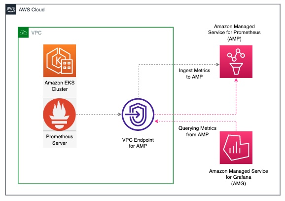

## 4.2: Install AWS EBS CSI Driver

The Amazon Elastic Block Store (Amazon EBS) Container Storage Interface (CSI) driver provides a CSI interface that allows Amazon Elastic Kubernetes Service (Amazon EKS) clusters to manage the lifecycle of Amazon EBS volumes for persistent volumes. The CSI driver is deployed as a set of Kubernetes Pods. These Pods must have permission to perform EBS API operations, such as creating and deleting volumes, and attaching volumes to the EC2 worker nodes that comprise the cluster.
The CSI is required to create and attach a persistent volume (EBS Volume) to the Prometheus server running on the EKS Cluster
````
kubectl apply -k "github.com/kubernetes-sigs/aws-ebs-csi-driver/deploy/kubernetes/overlays/stable/?ref=release-1.12"
````

verify
````
kubectl get pods  -A | grep ebs
kube-system   ebs-csi-controller-5cf866bf74-2wg5k   6/6     Running   0          4m49s
kube-system   ebs-csi-controller-5cf866bf74-kjn87   6/6     Running   0          4m49s
kube-system   ebs-csi-node-2pxn9                    3/3     Running   0          4m49s
kube-system   ebs-csi-node-vkw8v                    3/3     Running   0          4m49s
````

## 4.3: Setting up a workspace to collect Prometheus metrics

To get started, you will first create a workspace. A workspace is the conceptual location where you ingest, store, and query your Prometheus metrics that were collected from application workloads, isolated from other AMP workspaces. One or more workspaces may be created in each Region within the same AWS account and each workspace can be used to ingest metrics from multiple workloads that export metrics in Prometheus-compatible format.

Aditionally, you will create an interface VPC endpoint in order to securely and privately access the managed service from resources deployed within your VPC. This will ensure that data ingested by the managed service do not leave the VPC in your AWS account. You can do this by running the cloudformation template as follows.

**Cloudformation Template**

````   
  AMP.yaml
````

*   Go to CloudFormation console by selecting CloudFormation from Services drop down or by search menu.
    *   Select Create stack, with new resources(standard).
    *   Click Template is ready (default), "Upload a template file", "Choose file". Select "AMP.yaml" file that you have downloaded from this Gitlab.
    * Stack name -> amp
    * Parameters:
      * WorkspaceAlias -> The name of the AWS Prometheus Workspace
      * VpcId -> vpc for the eks infrastructure 
      * Subnets -> primaryAZ1 and primaryAZ2(this is for main primary K8s networking network)

### Configuring permissions

Metrics collectors (such as a Prometheus server deployed to an Amazon EKS cluster) scrape operational metrics from containerized workloads running in the cluster and send them to AMP for long-term storage as well as for subsequent querying by monitoring tools. The data is sent using HTTP(S) requests which must be signed with valid AWS credentials using the AWS Signature Version 4 algorithm to authenticate and authorize each client request for the managed service. In order to facilitate this, the requests are sent to an instance of AWS signing proxy which will forward the requests to the managed service.

The AWS signing proxy can be deployed to an Amazon EKS cluster to run under the identity of a Kubernetes service account. With IAM roles for service accounts (IRSA), you can associate an IAM role with a Kubernetes service account and thus provide AWS permissions to any pod that uses that service account. This follows the principle of least privilege by using IRSA to securely configure the AWS signing proxy to help ingest Prometheus metrics into AMP.

The shell script shown below can be used to execute the following actions after substituting the placeholder variable YOUR_EKS_CLUSTER_NAME with the name of your Amazon EKS cluster. The following actions will result:

- Creates an IAM role with an IAM policy that has permissions to remote-write into an AMP workspace
- Creates a Kubernetes service account that is annotated with the IAM role
- Creates a trust relationship between the IAM role and the OIDC provider hosted in your Amazon EKS cluster

````
export AWS_ACCOUNT_ID=$(aws sts get-caller-identity --query "Account" --output text)
export AWS_REGION=sa-east-1
export CLUSTER_NAME=<<YOUR_EKS_CLUSTER_NAME>>
export OIDC_PROVIDER=$(aws eks describe-cluster --name $CLUSTER_NAME --query "cluster.identity.oidc.issuer" --output text | sed -e "s/^https:\/\///")
export EKS_AMP_WORKSPACE_NAME=<<The name/alias of the AWS Prometheus Workspace>>
export EKS_AMP_WORKSPACE_ID=<<The AWS Prometheus Workspace ID>>
export SERVICE_ACCOUNT_NAMESPACE=prometheus
export SERVICE_ACCOUNT_AMP_INGEST_NAME=amp-iamproxy-ingest-service-account
export SERVICE_ACCOUNT_IAM_AMP_INGEST_ROLE=amp-iamproxy-ingest-role
export SERVICE_ACCOUNT_IAM_AMP_INGEST_POLICY=AMPIngestPolicy

KUBECONFIG=${PWD}/${CLUSTER_NAME}/${CLUSTER_NAME}-eks-a-cluster.kubeconfig
````

Set up a trust policy designed for a specific combination of K8s service account and namespace to sign in from a Kubernetes cluster which hosts the OIDC Idp.

````
cat <<EOF > TrustPolicy.json
{
  "Version": "2012-10-17",
  "Statement": [
    {
      "Effect": "Allow",
      "Principal": {
        "Federated": "arn:aws:iam::${AWS_ACCOUNT_ID}:oidc-provider/${OIDC_PROVIDER}"
      },
      "Action": "sts:AssumeRoleWithWebIdentity",
      "Condition": {
        "StringEquals": {
          "${OIDC_PROVIDER}:sub": "system:serviceaccount:${SERVICE_ACCOUNT_NAMESPACE}:${SERVICE_ACCOUNT_AMP_INGEST_NAME}"
        }
      }
    }
  ]
}
EOF
#
# Set up the permission policy that grants ingest (remote write) permissions for all AMP workspaces
#
cat <<EOF > PermissionPolicyIngest.json
{
  "Version": "2012-10-17",
   "Statement": [
       {"Effect": "Allow",
        "Action": [
           "aps:RemoteWrite"
        ], 
        "Resource": "*"
      }
   ]
}
EOF

function getRoleArn() {
  OUTPUT=$(aws iam get-role --role-name $1 --query 'Role.Arn' --output text 2>&1)

  # Check for an expected exception
  if [[ $? -eq 0 ]]; then
    echo $OUTPUT
  elif [[ -n $(grep "NoSuchEntity" <<< $OUTPUT) ]]; then
    echo ""
  else
    >&2 echo $OUTPUT
    return 1
  fi
}

#
# Create the IAM Role for ingest with the above trust policy
#
SERVICE_ACCOUNT_IAM_AMP_INGEST_ROLE_ARN=$(getRoleArn $SERVICE_ACCOUNT_IAM_AMP_INGEST_ROLE)
if [ "$SERVICE_ACCOUNT_IAM_AMP_INGEST_ROLE_ARN" = "" ]; 
then
  #
  # Create the IAM role for service account
  #
  SERVICE_ACCOUNT_IAM_AMP_INGEST_ROLE_ARN=$(aws iam create-role \
  --role-name $SERVICE_ACCOUNT_IAM_AMP_INGEST_ROLE \
  --assume-role-policy-document file://TrustPolicy.json \
  --query "Role.Arn" --output text)
  #
  # Create an IAM permission policy
  #
  SERVICE_ACCOUNT_IAM_AMP_INGEST_ARN=$(aws iam create-policy --policy-name $SERVICE_ACCOUNT_IAM_AMP_INGEST_POLICY \
  --policy-document file://PermissionPolicyIngest.json \
  --query 'Policy.Arn' --output text)
  #
  # Attach the required IAM policies to the IAM role created above
  #
  aws iam attach-role-policy \
  --role-name $SERVICE_ACCOUNT_IAM_AMP_INGEST_ROLE \
  --policy-arn $SERVICE_ACCOUNT_IAM_AMP_INGEST_ARN  
else
    echo "$SERVICE_ACCOUNT_IAM_AMP_INGEST_ROLE_ARN IAM role for ingest already exists"
fi
echo $SERVICE_ACCOUNT_IAM_AMP_INGEST_ROLE_ARN
````

Amazon Managed Service for Prometheus does not directly scrape operational metrics from containerized workloads in a Kubernetes cluster. It requires users to deploy and manage a standard Prometheus server in their cluster to perform this task

Execute the following commands to deploy the Prometheus server on the EKS cluster:

````
helm repo add prometheus-community https://prometheus-community.github.io/helm-charts
````
Let's create a new EKS namespace for monitoring:

````
kubectl create ns prometheus
````
Create a file called amp_ingest_override_values.yaml with the following content in it. Replace the {YOUR_EKS_AMP_WORKSPACE_ID} with your workspace ID:


````
## The following is a set of default values for prometheus server helm chart which enable remoteWrite to AMP
## For the rest of prometheus helm chart values see: https://github.com/prometheus-community/helm-charts/blob/main/charts/prometheus/values.yaml
##
serviceAccounts:
        server:
            name: "amp-iamproxy-ingest-service-account"
            annotations:
                eks.amazonaws.com/role-arn: "arn:aws:iam::949500376971:role/amp-iamproxy-ingest-role"
server:
    remoteWrite:
        - url: https://aps-workspaces.sa-east-1.amazonaws.com/workspaces/{YOUR_EKS_AMP_WORKSPACE_ID}/api/v1/remote_write
          sigv4:
            region: sa-east-1
          queue_config:
            max_samples_per_send: 1000
            max_shards: 200
            capacity: 2500

````

Execute the following command to install the Prometheus server configuration and configure the remoteWrite endpoint.

````
helm install prometheus-for-amp prometheus-community/prometheus -n prometheus -f ./amp_ingest_override_values.yaml
````

## 4.4: AWS Single Sign-On (AWS SSO)

To use Amazon Managed Grafana in a flexible and convenient manner, we chose to use AWS Single Sign-On (AWS SSO) for user management. AWS SSO is available once you’ve enabled AWS Organizations manually, or it is auto-enabled while setting up AWS Control Tower.

Amazon Managed Grafana integrates with AWS SSO to provide identity federation for your workforce. Using Amazon Managed Grafana and AWS SSO, users are redirected to their existing company directory to sign in with their existing credentials. Then, they are seamlessly signed in to their Amazon Managed Grafana workspace. This ensures that security settings such as password policies and two-factor authentication are enforced. Using AWS SSO does not impact your existing IAM configuration.

### Create Amazon Managed Grafana workspace and query metrics from Amazon Managed Service for Prometheus workspace

You can easily spin up on-demand, auto scaled Grafana workspaces (virtual Grafana servers) that enable you to create unified dashboards across multiple data sources. Before we can use Amazon Managed Grafana for the following example, we need to set it up. In the following example, we’re using the AWS console to walk you through the required steps and comment on things to consider when performing each step.

After you select the Create workspace button in the right upper corner of the Amazon Managed Grafana console landing page, give your new workspace a name and, optionally, a description:

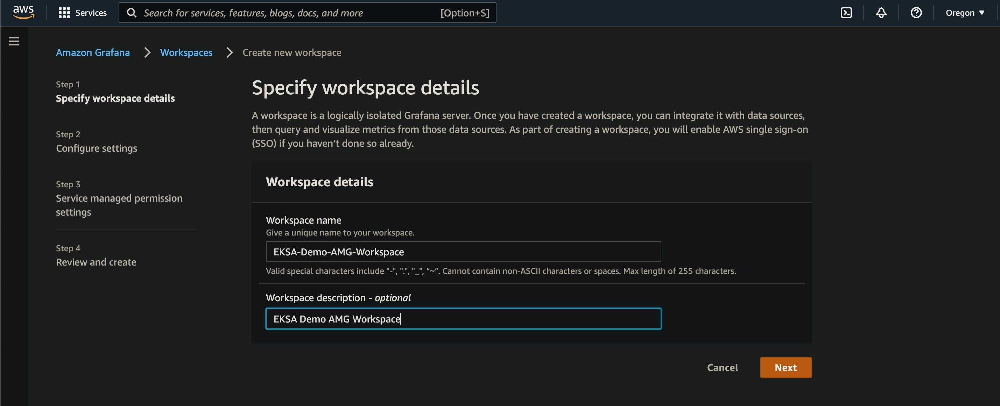

In this step, you also have to enable AWS Single Sign-On (AWS SSO) for Amazon Managed Grafana since this is how we manage user authentication to Grafana workspaces. 

Also, choose Service managed as the permission type:

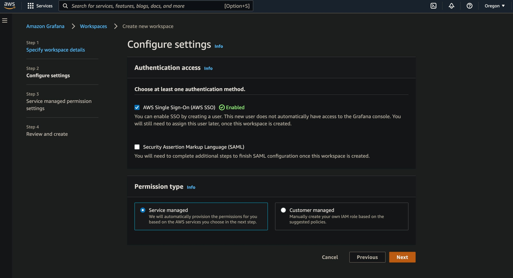

In the next screen, please select the following data sources and SNS as the notification channel. Then select Next.

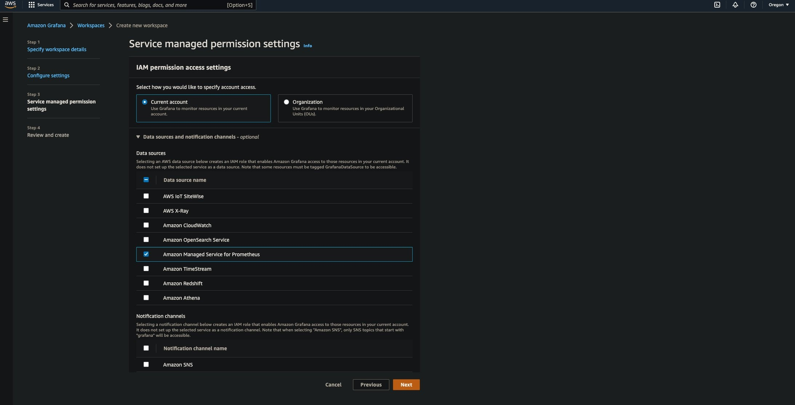

In the next screen, select Create workspace without any selections to create the Amazon Managed Grafana workspace.

By default, the AWS SSO user has Viewer permissions. Since we will be adding new data sources and creating a dashboard in Amazon Managed Grafana, you want to update the user type as admin. Under the Authentication tab, select the Configure users and user groups button, select the SSO user you want to use to sign in to Grafana, and select the Make admin button, as shown in the following screenshot:

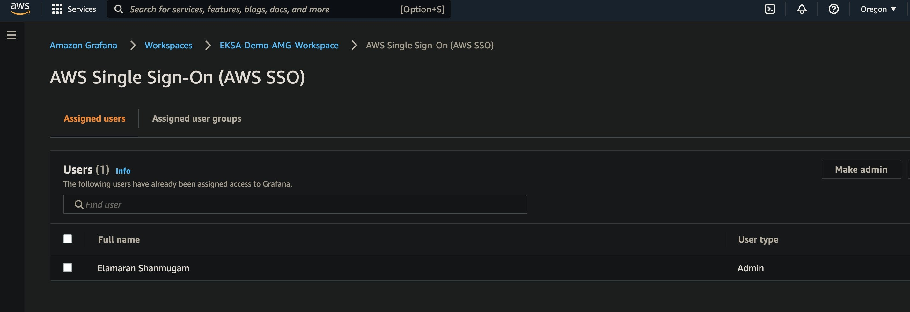

### Query metrics from Amazon Managed Service for Prometheus workspace

*   In the Summary section, select the Grafana workspace URL. This will take you to the AWS SSO sign-in screen, where you can provide the UserId and Password of your configured SSO user.
*   Once you’re signed in to the Amazon Managed Grafana console, navigate to the Configuration (gear) section on the left navigation bar. Select Data sources to add the Amazon Managed Service for Prometheus datasource.

On the right, select the Add data source button and select Prometheus, as shown in the following screenshot:

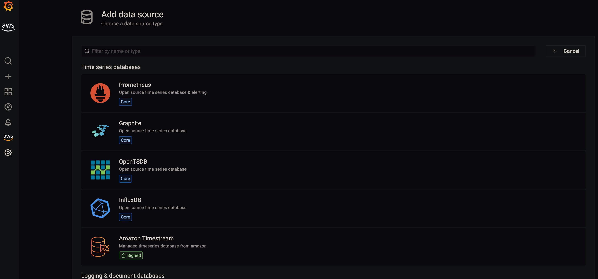

### Configure Prometheus data source:

-   In Name, let’s add AMPDataSource or any name you prefer.
-   In URL, add the Amazon Managed Service for Prometheus workspace remote write URL without the api/v1/remote_write at the end.
-   Enable SigV4auth.
-   Under the SigV4Auth Details section:
-   For Default Region, choose the Region where you created the Amazon Managed Service for Prometheus workspace
-   Select the Save and test You should receive the notification data source working.

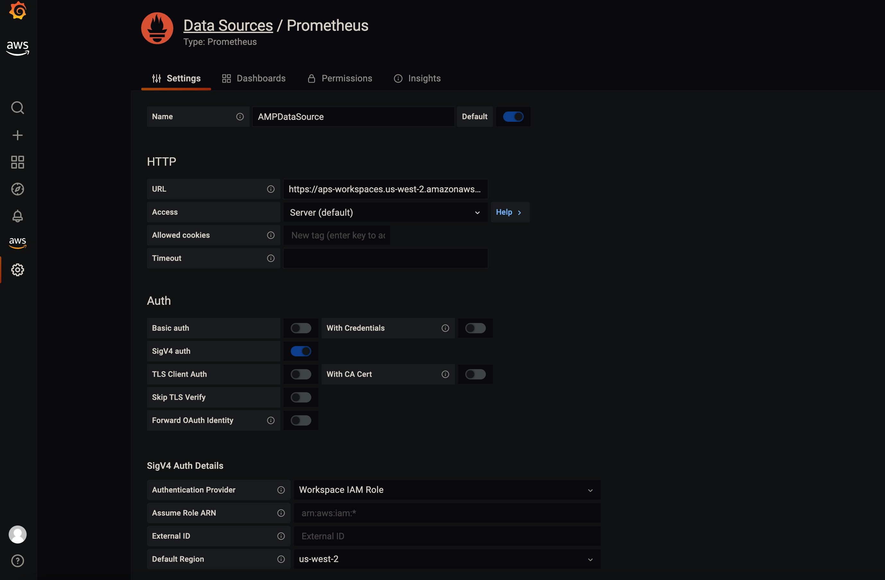

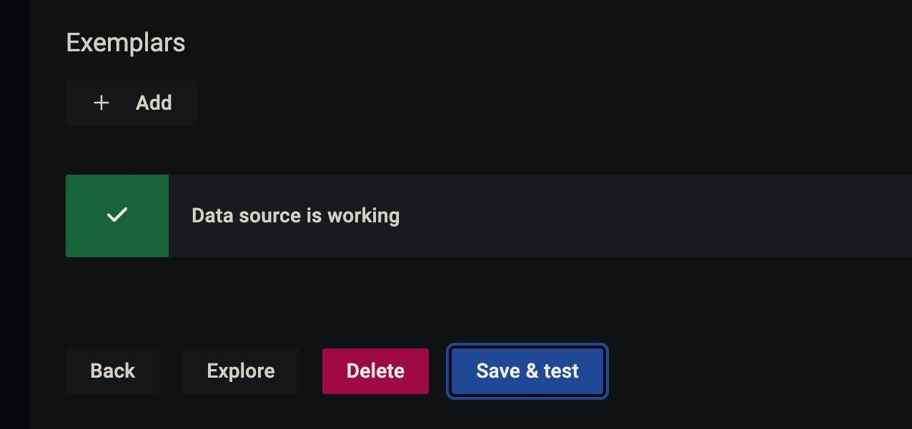

You will notice that the Amazon Managed Service for Prometheus data source is authenticated through SigV4 protocol. Grafana (7.3.5 and above) has the AWS SigV4 proxy built-in as a plugin, which makes this possible

-   Now choose Explore from the left navigation bar to query metrics and enter the following query in the text box: apiserver_current_inflight_requests. Please refer to EKS Control Plane in the EKS Best Practices Guides to learn more about the Amazon EKS control plane metrics you can monitor using Prometheus to proactively understand the performance of your Amazon EKS cluster.
-   You will receive a screen similar to the one in the following screenshot, which shows that we are able to successfully query metrics from the EKSA cluster through the Amazon Managed Service for Prometheus workspace:

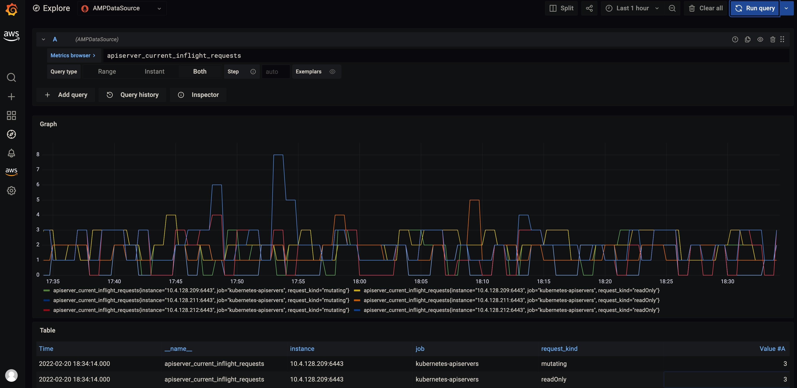


You can also import the existing dashboard by selecting the plus (+) sign on the left navigation bar.

-   Select Import.
-   In the Import screen, type “3119” in the Import via grafana.com textbox and select Import.
-   From the dropdown at the bottom, select AMPDataSource and select Import.

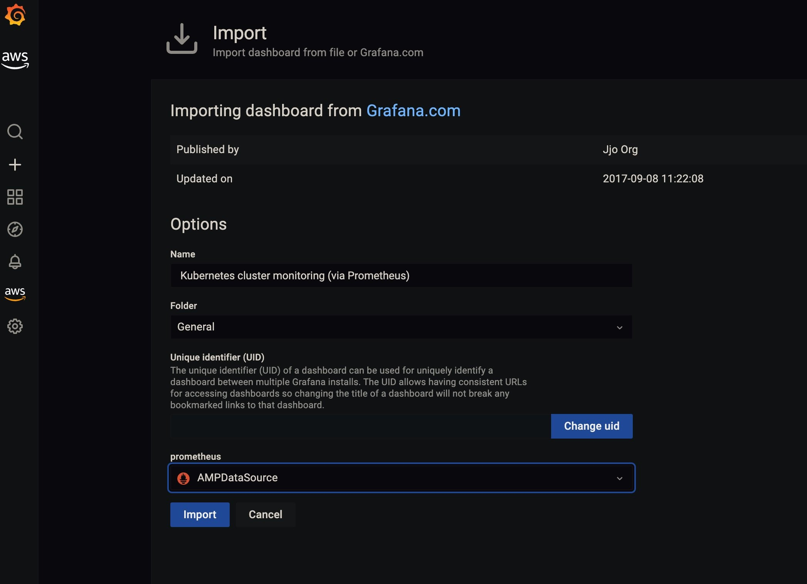

Once complete, you will be able to confirm the Grafana dashboard is presenting metrics from the EKSA cluster through the Amazon Managed Service for Prometheus data source, as shown in the following screenshot.

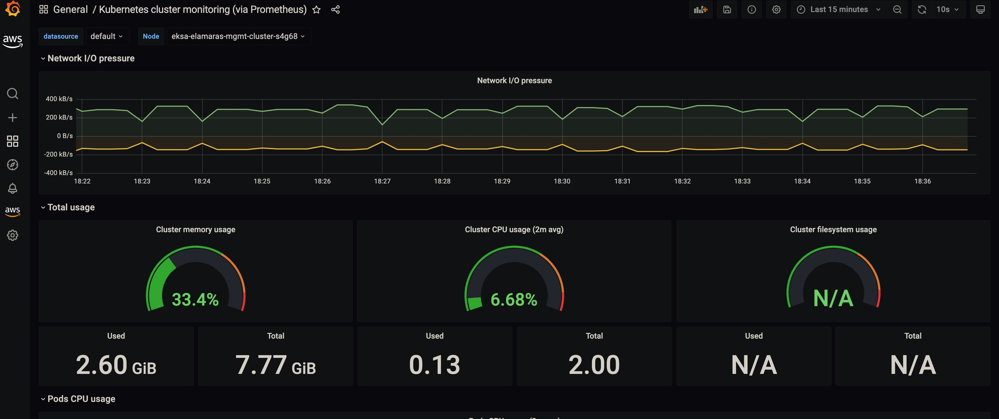